class: inverse, middle

```{r Setup, include = F}

library(pacman)
p_load(ggthemes, viridis, knitr, dslabs, gapminder, extrafont, Ecdat, wooldridge, tidyverse, magrittr)
options(htmltools.dir.version = FALSE)
# Define colors
red_pink <- "#e64173"
met_slate <- "#272822" 
turquoise <- "#20B2AA"
orange <- "#FFA500"
red <- "#fb6107"
blue <- "#2b59c3"
green <- "#8bb174"
grey_light <- "grey70"
grey_mid <- "grey50"
grey_dark <- "grey20"
purple <- "#6A5ACD"
slate <- "#314f4f"
# Notes directory
dir_slides <- "~/Lectures/01-Intro"
# Knitr options
opts_chunk$set(
  comment = "#>",
  fig.align = "center",
  fig.height = 7,
  fig.width = 10.5,
  warning = F,
  message = F
)  
opts_chunk$set(dev = "svg")
options(device = function(file, width, height) {
  svg(tempfile(), width = width, height = height)
})
options(crayon.enabled = F)
options(knitr.table.format = "html")
```

```{css, echo = F, eval = F}
@media print {
  .has-continuation {
    display: block !important;
  }
}
```

# Studying the Global Economy

---

# Course Objectives

<br>

For this class we will


* study workhorse models explaining why countries/firms trade

--


* analyze theoretical and empirical applications of these models

--

* think critically about the current state of the literature

--

* develop original research ideas


---
class: clear-slide

Synergies with other fields...

```{r, echo=FALSE, out.width="80%"}
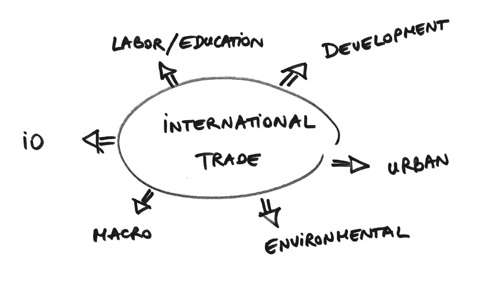
```


---

# Today's Plan
<br>

1. __Course Logistics__

1. About Me

1. Key facts about international trade

1. If time allows.. overview of key models of trade


---

# Course logistics

<br>


Housekeeping:

* Office hours: before class at 1pm & by appointment

* No required textbook $\rightarrow$ journal articles

* Required readings + class participation

* No exams $\rightarrow$ focus on critical thinking + presentation/writing skills

--

Content will be available on Canvas.

---

# Course logistics

<br>

Content and grading:

<small>

.pull-left[
* .hi-slate[W1-W6:] Theory of Trade
* .hi-slate[W6-W11:] Trade Policy and Multinationals
* .hi-slate[W11-W16:] Global Finance
]

.pull-right[
* 15% - Class Participation & Paper Critiques $\times 2$
* 20% - Written Assignments $\times 2$ 
* 10% - Term Paper Proposal 
* 35% - Term Paper 
* 20% - Class Presentations  $\times 2$
]

</small>

<br>

<br>

<br>

<br>

Will provide guidance on preparing written assignments. Questions always welcome.


---


# Today's Plan
<br>

1. Course Logistics

1. __About Me__

1. Key facts about international trade

1. If time allows.. overview of key models of trade


---

# About Me


[**Philip Economides**](https://philip-economides.com)

-  2017-2019: RA at ESRI/Trinity College Dublin (Ireland),<br>2019-2024: PhD Candidate & Lecturer (University of Oregon),<br>2024-Present: Assistant Professor (Texas Tech University)

- Focus: International Trade, Transport Economics, Applied Econometrics


--

.hi-pink[Where can you find me?]

- Holden Hall 236, Tues/Thurs 13:00-14:00, or by appointment

- Email: [.mono[peconomi@ttu.edu]](mailto:peconomi@ttu.edu) *(use ECO 5325 in the subject line)*

---

# About Me

<br>

* Empirical/Structural Work

* Main Research Areas:
  
  * Role of transportation services in international trade
  
  * Multinational profit-shifting & activities
  
  * Environmental implications of international trade
  
  
---

# Research Topic I: Trade/Transport

<br>

Trade relies heavily on containerships (60-70% of global trade volume)

* Asymmetric demand across bilateral trade routes

* Net outflows of loaded containers (e.g. US-China)

* Empty container repositioning $\implies$ .hi-pink[endogenous transport costs]

* How does government intervention (e.g. OSRA 2022) influence trade outcomes?


Challenges: Data availability ($), complex theoretical models


---

class: clear-slide

<br>


```{r, echo=FALSE, out.width="70%"}
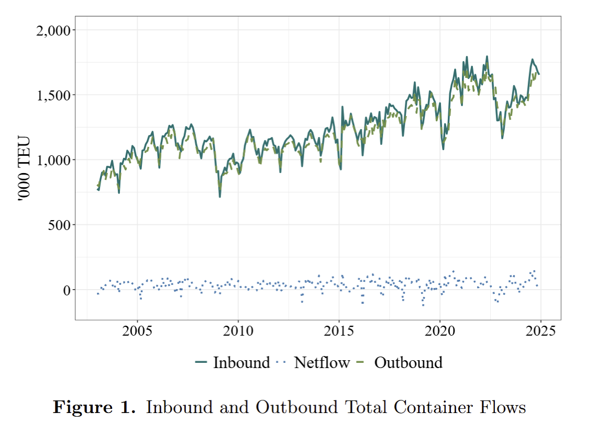
```

<small>Container exchanges are only balanced when taking empties into account</small>

---

class: clear-slide

<br>


```{r, echo=FALSE, out.width="90%"}
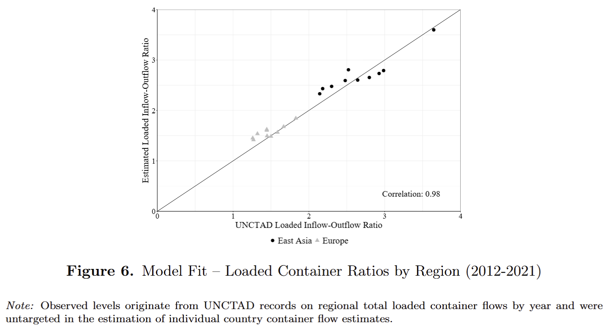
```

<small>Estimates of country-specific container flows fit strongly at observed regional levels</small>

---

class: clear-slide

<br>


CF: .hi-pink[Moderate restriction to US empty container outflows]

```{r, echo=FALSE, out.width="90%"}
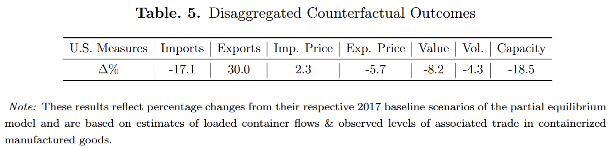
```

* Cost of servicing assymetric lanes has risen, inducing price response<small>

  * Import leg $\rightarrow$ freight rate increase
  
  * Export leg $\rightarrow$ freight rate decline</small>
  
--
  
* Imports $\downarrow$, exports $\uparrow$ $\implies$ overall trade falls


--

* Pronounced decline in trade with East Asian trade partners


---

# Research Topics II: Multinational Firms

Developments in transportation and communication...

$\implies$ fragmentation of production across national borders

$\implies$ growth in multinational corporations


Conventional main questions:

* Why do some firms own subsidiaries abroad?

* Which factors determine the location of foreign subsidiaries?

* How is production and employment best organized across locations?

---

# Research Topics II: Multinational Firms


Growing focus on MNEs placing assets in low-tax jurisdictions

“Measuring Economic Activity in the Presence of Superstar MNEs”<br>(w. G. Nikolaishvili) .hi-pink[Economics Letters, 2023. Volume 226, 111077]

* How do these large shifts in strategic locations of ownership of intellectual property influence domestic economies?

* Main finding $-$ MNE presence in Ireland has inflated GDP by 22% relative to what state of domestic economy suggests

* Secondary finding $-$ No relationship between shocks to profit-shifting activity of MNEs and domestic economy


---

class: clear-slide

<br>


```{r, echo=FALSE, out.width="90%"}
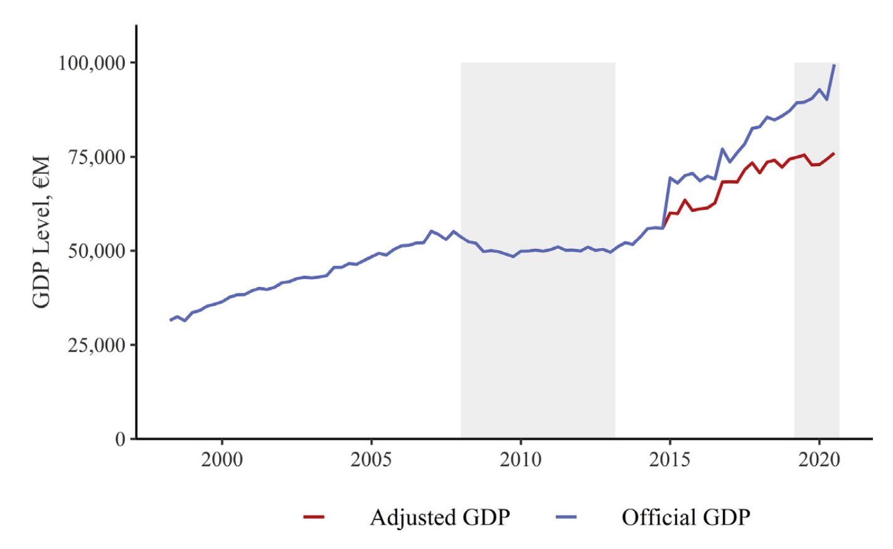
```


---

class: clear-slide

<br>


```{r, echo=FALSE, out.width="80%"}
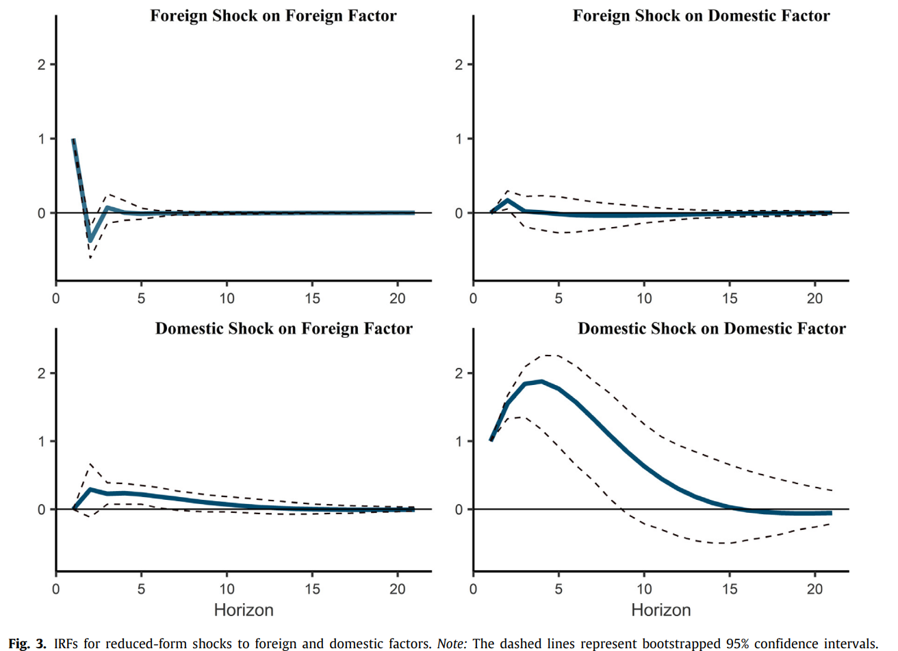
```


---

class: clear-slide

<br>


```{r, echo=FALSE, out.width="90%"}
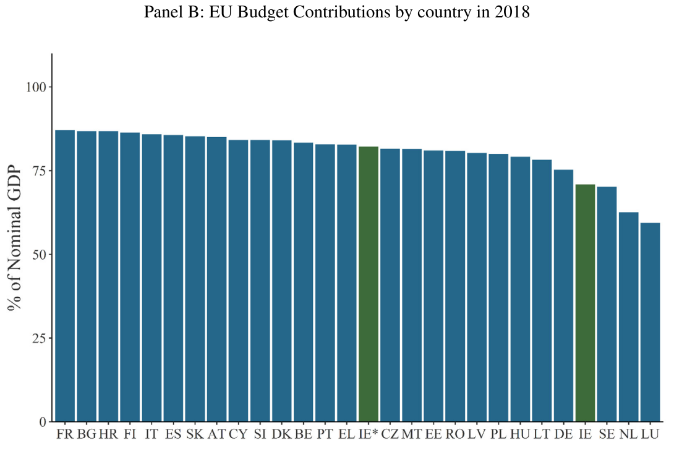
```


---

# Research Topics III: Environment/Trade

Global shipping emissions undermine extent to which trade fuels welfare gains

How do new logistical/queuing systems influence emissions?

My work:

* Considers the new queue system at LA/LB which assigns queue positions based on vessels' estimated time of arrival

* Prior system assigned queue positions upon reaching within 20 nautical miles of LA/LB, incentivized speeding

* How did new system influence global and local emissions?


---

class: clear-slide

<br>


```{r, echo=FALSE, out.width="80%"}
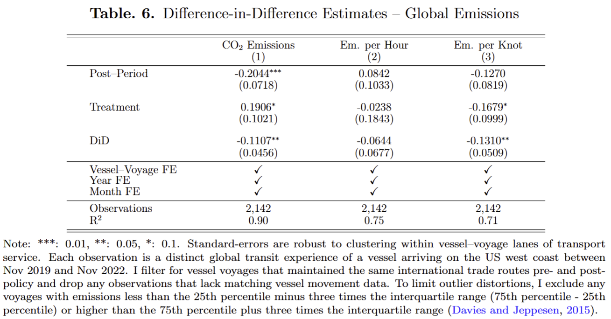
```


New system delivers per-vessel emission reductions of approximately 10 per cent

---
class: clear-slide

<br>


```{r, echo=FALSE, out.width="80%"}
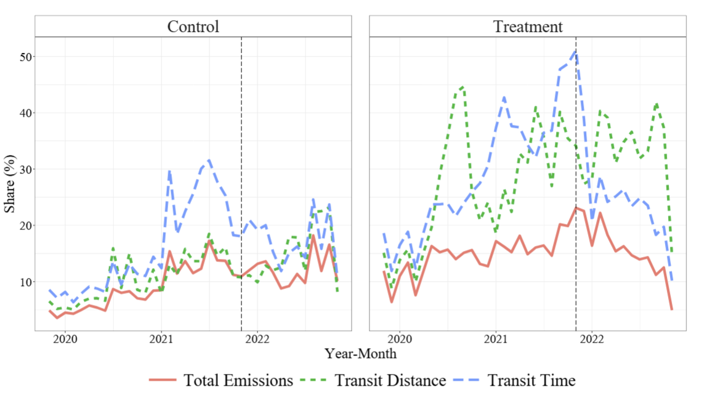
```

Driven by a reduction of time spent queuing/idling in local area.

---


class: clear-slide

```{r, echo=FALSE, out.width="80%"}
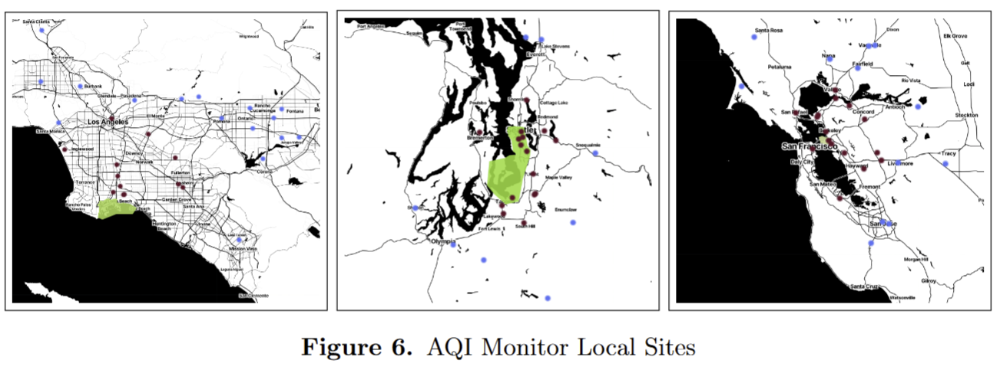
```


Local air quality monitors suggest that air quality .hi-pink[deteriorated]

* Within 25-mile radius vs outer 25-50 mile ring <small><br>(difference out shocks across LA)</small>

* Within 25-mile LA/LB vs Within 25-mile control ports <small><br>(difference out shocks across ports)</small>

Same magnitude of effect across both DiDs.


---

class: clear-slide

```{r, echo=FALSE, out.width="80%"}
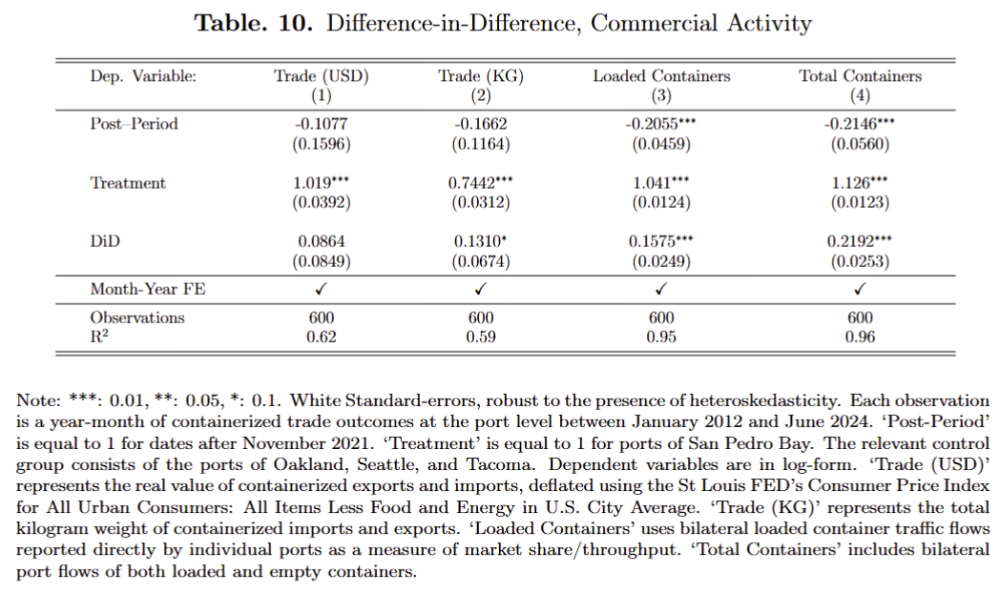
```

Relative to other west coast ports, LA/LB experienced a surge in trade volume

---

class: inverse, middle

# International Economics:

## Key Facts

---

# International Trade


<br>

Trade Theory $\leftrightarrow$ Trade Empirics

* Trade Theory $\rightarrow$ Testable implications

* Improved data that reveals new facts about trade $\rightarrow$ Theory


---

# International Trade


Rapid Growth of World Trade ... Faster than World GDP

```{r, echo=FALSE, out.width="80%"}
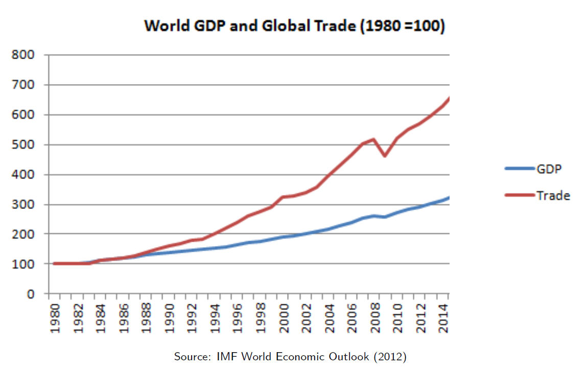
```

---

# International Trade


```{r, echo=FALSE, out.width="80%"}
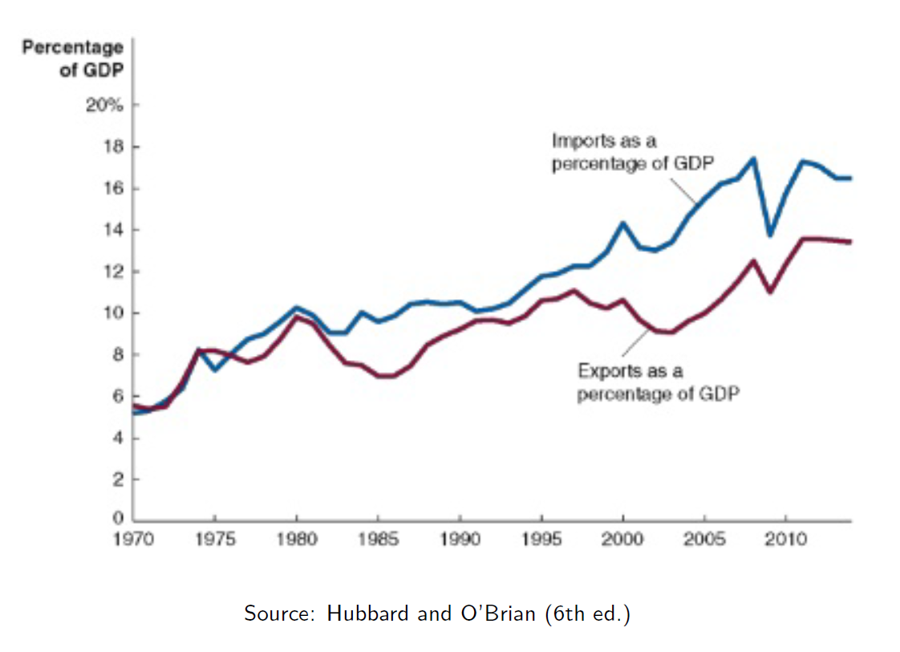
```


<small>Ratio of Trade to GDP for the U.S., 1970-2014</small>

---

# International Trade

<br>

```{r, echo=FALSE, out.width="80%"}
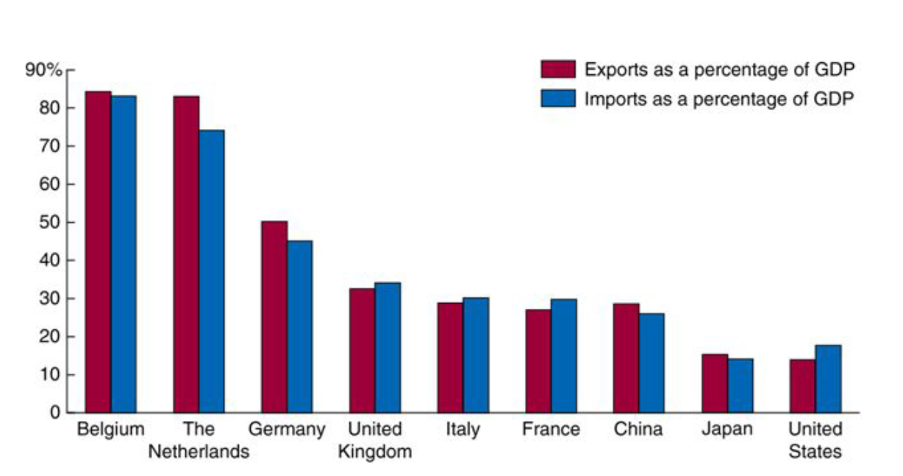
```


<small>Cross-Country Differences in Trade Openness/Reliance, 2014</small>

---

# Key Facts (I)

<br>

* Trade is important: it grows really fast

* Trade is related to economic growth

* Country size is related to global market integration (trade openness)


---

# International Trade

<br>

Main Questions:

* Why do countries trade? What are the main determinants of trade?

* What are the gains from trade?

* Does trade cause income growth?

<br>

**Part I of the course focuses on theories of international trade.**


---


# International Trade

<br>

<br>

Main Questions:

* What goods does each country trade?

* How does trade affect specialization?


---

# What Goods Do Countries Trade?

<br>

```{r, echo=FALSE, out.width="80%"}
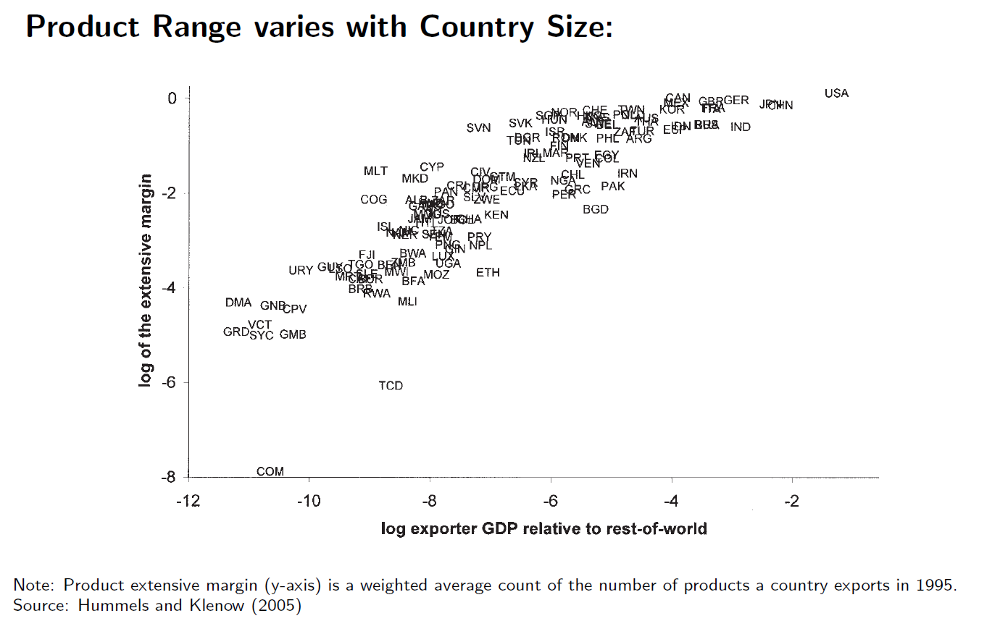
```

---
# What Goods Do Countries Trade?


```{r, echo=FALSE, out.width="80%"}
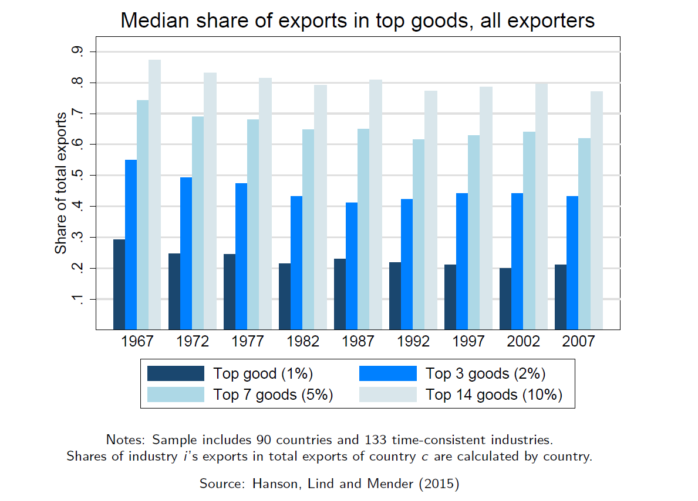
```

<small>Signs of Specialization and Comparative Advantage</small>

---
# What Goods Do Countries Trade?

<small>Dynamics in Specialization and Comparative Advantage</small>


```{r, echo=FALSE, out.width="80%"}
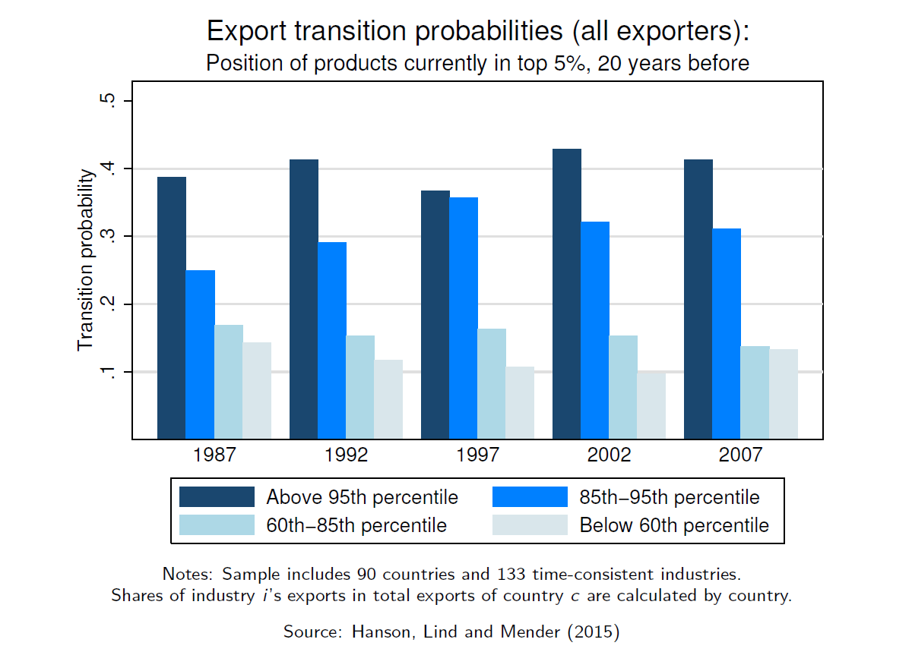
```

---

# Key Facts (II)

<br>

Countries specialize and export core products/sectors

Trading the goods that countries are "best" at $\rightarrow$ gains from trade

Dynamics in top ranking of export products

Factors other than country fundamentals influence specialization?

<small>

* knowledge diffusion?

* foreign direct investments (FDI)?

* cross-border migration?

</small>

---

# Barriers to Trade


```{r, echo=FALSE, out.width="90%"}
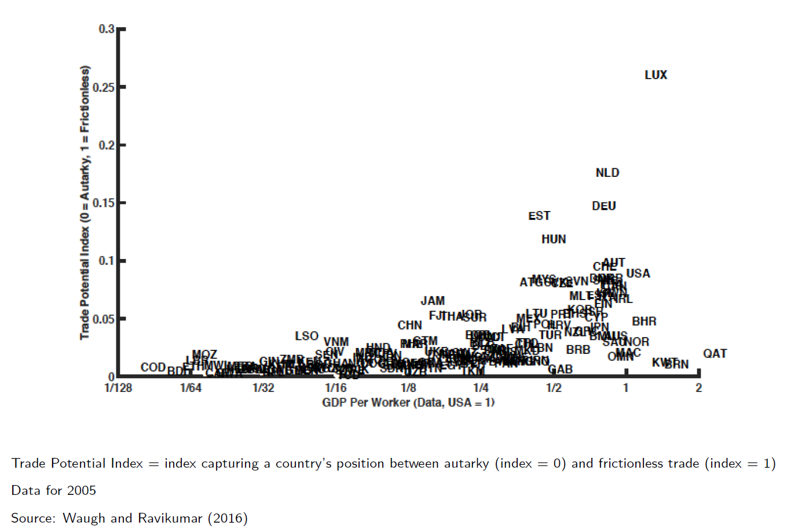
```


<small>Trade has been growing rapidly but the world is far from free trade.</small>


---
class: clear-slide, middle

**Main question:**


What barriers hinder international trade?


---
class: clear-slide, middle


```{r, echo=FALSE, out.width="85%"}
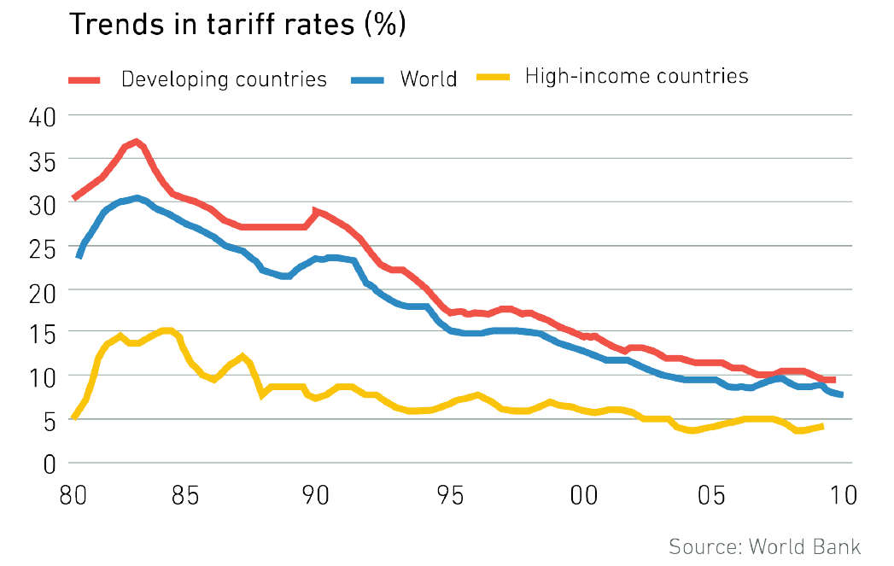
```


Import Tariffs Have Also Dropped Significantly


---

class: clear-slide, middle


```{r, echo=FALSE, out.width="85%"}
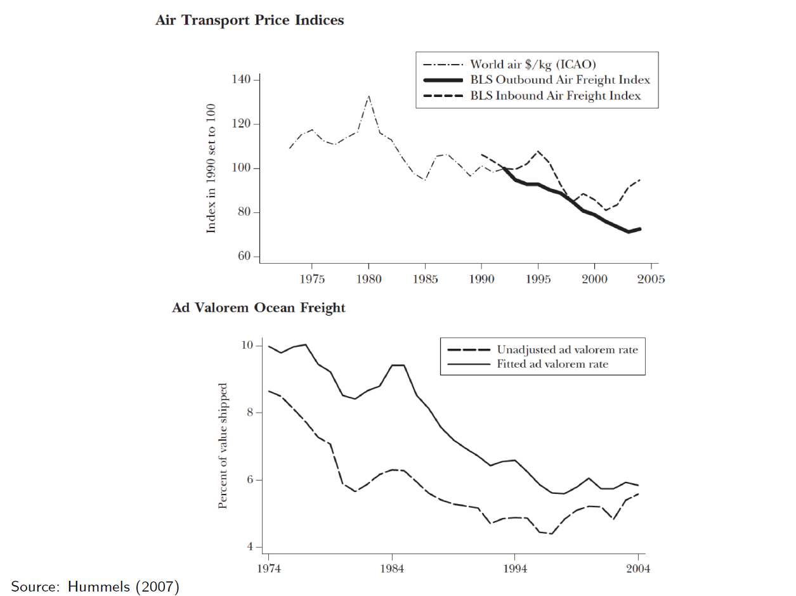
```


Transport Costs Have Fallen Over Time


---
class: clear-slide, middle


```{r, echo=FALSE, out.width="85%"}
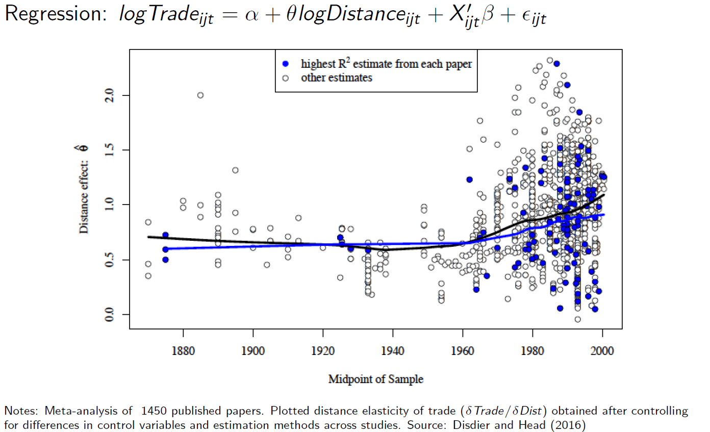
```


Distance Puzzle: Persistent Effect of Geographic Distance on Trade Flows


---
# Key Facts (III)

<br>


<br>

* Explicit trade barriers (e.g., transport costs and tariffs) have decreased over time

* Hidden barriers to trade still play an important role

**Identifying and measuring trade costs has important policy implications.**


---

# Firm Level Export Activity

<br>

So far... facts about country level or industry-level trade

Zooming-in:
- firm level decision to participate in international trade

**Main questions:**

* Who participates in global markets?

* What are the characteristics of exporting firms?

---

# Firm Level Export Activity

```{r, echo=FALSE, out.width="85%"}
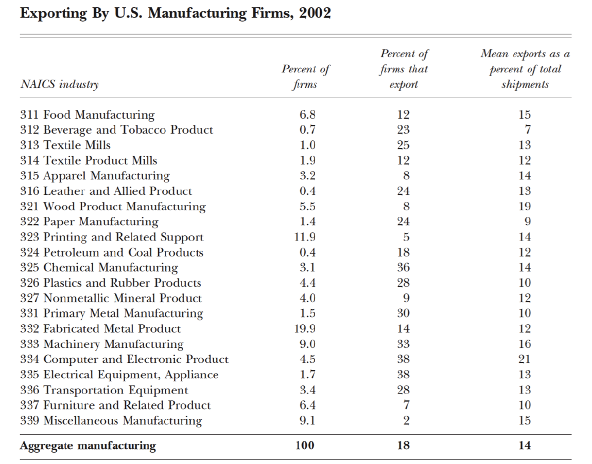
```

---

# Characteristics of Exporting Firms


Regression: $\log Y_{it} = \beta_0 + \beta_1 \text{Exporter}(0/1) + \epsilon_{it}$

```{r, echo=FALSE, out.width="85%"}
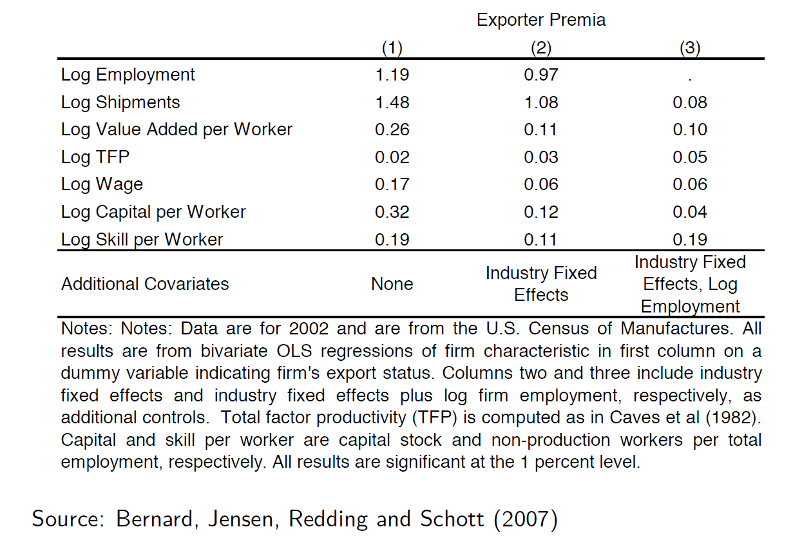
```


---

# Characteristics of Exporting Firms


```{r, echo=FALSE, out.width="85%"}
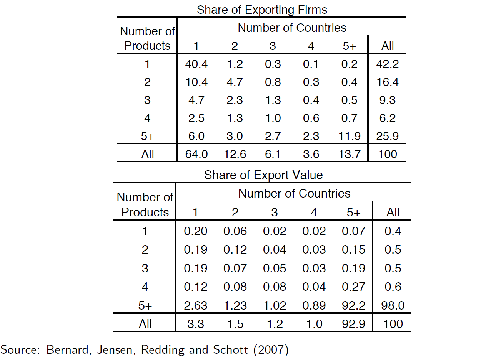
```

---

# Key Facts (IV)

<br>

* Exporting is rare: few firms export + small share of output exported

* Exporting firms are "better" than domestic firms<br><small>
(e.g., sales, productivity, employment, etc.)</small>

* Most exporters enter few foreign markets and sell few products

* Top exporters responsible for most of trade by value

**Firm heterogeneity plays an important role in trade models.**

---

class: clear-slide, middle

"Exceptional" Firms Are Multinational Corporations


```{r, echo=FALSE, out.width="85%"}
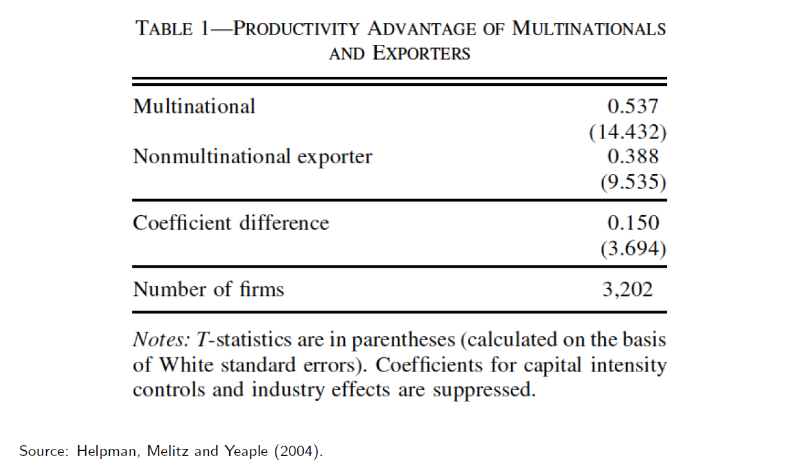
```

---

# Multinational Firms


<br>

**Main Questions:**

* Why do some firms become multinational? What determines FDI?

* Where do multinationals set affiliates?

* What determines location choices?

* How does multinational production affect:
 * host economies?
 * home economies?
 
---

class: clear-slide, middle

```{r, echo=FALSE, out.width="85%"}
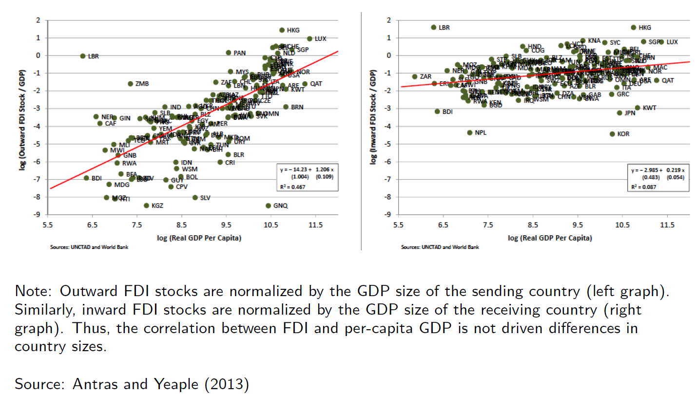
```


Multinational activity is concentrated in developed countries


---

class: clear-slide, middle

```{r, echo=FALSE, out.width="85%"}
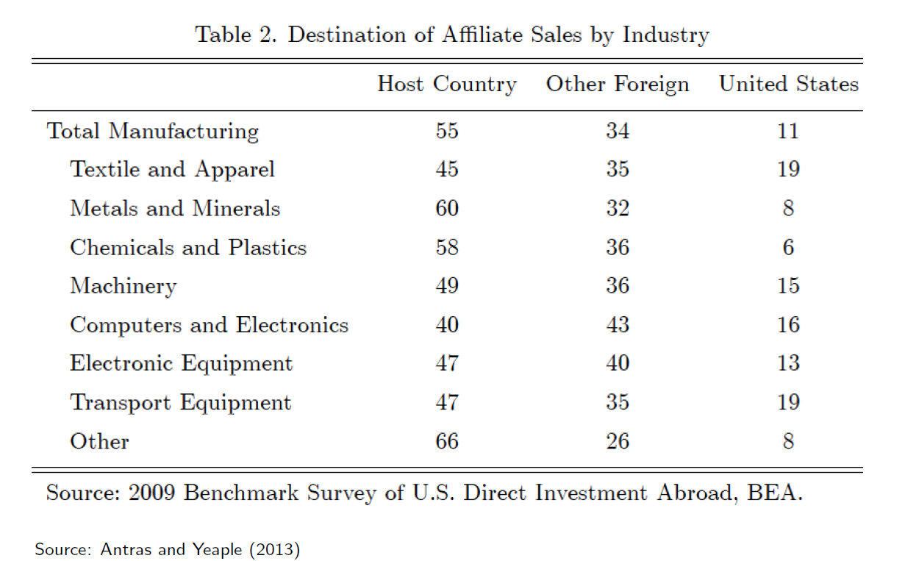
```


Foreign affiliates send little output back home


---
class: clear-slide

**Part I: Trade Theory**

<small> 1) Basic Trade Models: Why do countries trade? What determines specialization?</small>


**Part II: Topics in Trade**

<small> 2) Distributional Consequences of Trade<br>
What are the consequences of opening up to trade?<br>For firms and industries? For workers and local labor markets?</small>

<small>3) Multinational Production<br>Why do firms invest abroad? How do they choose where to locate?</small>

<small>4) Trade Agreements & Optimal Tariffs: Why do countries set protectionist policies?</small>


**Part III: Global Finance**

<small>We'll open up this can of worms further down the line.</small>

---
class: clear-slide, middle


## Theories of International Trade

---


# Theories

<br>

Two strands within the field of international trade:

1) **Neoclassical models of trade** ('old' theories):

$\rightarrow$ Ricardian model

$\rightarrow$ Heckscher-Ohlin model

2) **'New' trade theory**:

$\rightarrow$ Krugman model

$\rightarrow$ Melitz model


---

exclude: true

```{R generate pdfs, include = F, eval = F}
#remotes::install_github('rstudio/pagedown')
library(pagedown)
pagedown::chrome_print("01-intro.html", output = "01-intro.pdf")
```
